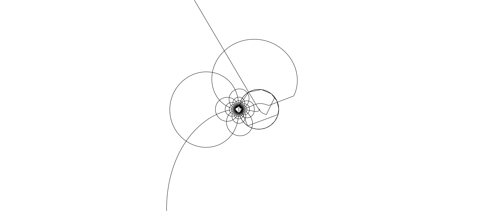

I like math. I like to code.

- 👋 Hi, I’m @JulieISBaka
- 👀 I’m interested in AI and ML
- 🌱 I’m currently learning [Rust](https://www.rust-lang.org/)
- 💞️ I’m looking to collaborate on anything
- 📫 <Casperschorr06@gmail.com>
- 😄 Pronouns: He/Him
- ⚡ Fun fact: Math is the best thing ever!

<!---
JulieISBaka/JulieISBaka is a ✨ special ✨ repository because its `README.md` (this file) appears on your GitHub profile.
You can click the Preview link to take a look at your changes.
--->

